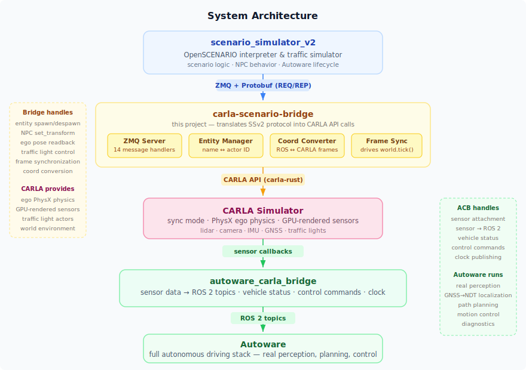

# carla-scenario-bridge

Run [OpenSCENARIO](https://www.asam.net/standards/detail/openscenario-v200/) scenarios in CARLA with Autoware processing **real sensor data** through its full perception pipeline.

## What is this?

[Autoware](https://autowarefoundation.github.io/autoware-documentation/main/) is an open-source autonomous driving stack. It is typically tested with [scenario_simulator_v2](https://github.com/tier4/scenario_simulator_v2) (SSv2), a framework that runs OpenSCENARIO files against a simulator backend. The default backend is a lightweight "simple sensor simulator" that feeds Autoware **ground-truth data** — perfect detections, exact positions — skipping the perception pipeline entirely.

[CARLA](https://carla.org/) is a photorealistic driving simulator with GPU-rendered cameras, ray-cast lidar, and PhysX vehicle dynamics. It produces realistic, noisy sensor streams that exercise Autoware's full stack: perception, localization (GNSS → NDT scan matching), planning, and control.

**carla-scenario-bridge** connects the two. It implements SSv2's ZMQ+Protobuf `simulation_interface` protocol, translating each request into CARLA API calls via [carla-rust](https://github.com/jerry73204/carla-rust). This makes CARLA a drop-in replacement for SSv2's built-in simulator or [AWSIM](https://github.com/tier4/AWSIM), letting you run the same `.xosc` scenario files against a high-fidelity environment where Autoware must actually *see* and *react* to the world.

### How it works

<p align="center">
  
</p>

- **SSv2** parses the OpenSCENARIO file, drives scenario logic and NPC behavior, and manages Autoware's lifecycle (launch, localization init, route, engage).
- **carla-scenario-bridge** (this project) receives SSv2 commands over ZMQ, spawns/moves entities in CARLA, controls traffic lights, synchronizes frames, and reports ego pose back.
- **CARLA** provides ego vehicle physics and GPU-rendered sensors (lidar, camera, IMU, GNSS).
- **[autoware_carla_bridge](https://github.com/NEWSLabNTU/ros_zenoh_bridge)** publishes CARLA sensor data as ROS 2 topics, relays vehicle status, and applies Autoware's control commands back to CARLA.
- **Autoware** processes real sensor data through its complete perception → planning → control pipeline.

## Getting Started

### Prerequisites

- **CARLA 0.9.16** — [installation guide](https://carla.readthedocs.io/en/0.9.16/start_quickstart/)
- **ROS 2 Humble** — [installation guide](https://docs.ros.org/en/humble/Installation.html)
- **Autoware** — pre-built packages or source install ([docs](https://autowarefoundation.github.io/autoware-documentation/main/installation/))

Clone the repository with submodules:

```bash
git clone --recurse-submodules https://github.com/NEWSLabNTU/carla-scenario-bridge.git
cd carla-scenario-bridge
```

Install build dependencies (Rust toolchain, colcon-cargo, system libraries):

```bash
just install-deps
```

This installs the Rust stable + nightly toolchains, `cargo-nextest`, `colcon-cargo`/`colcon-ros-cargo` (for building Rust ament packages), and system libraries (`libclang-dev`, `protobuf-compiler`, `libzmq3-dev`).

### Build

Source the ROS environment, then build:

```bash
# If using direnv, the environment is sourced automatically.
# Otherwise, source manually:
source /opt/ros/humble/setup.bash

just build
```

### Run the end-to-end demo

The bundled `town01_ego_drive.xosc` scenario spawns an ego vehicle on CARLA's Town01 map, plans a route, and drives autonomously to the goal.

```bash
# 1. Start CARLA (background systemd service, takes ~30s to initialize)
just carla-start

# 2. Launch everything: adapter + sensor bridge + SSv2 + Autoware
just e2e

# Check CARLA status at any time
just carla-status

# When done
just carla-stop
```

To run a custom scenario:

```bash
just e2e /path/to/your_scenario.xosc
```

### Environment variables

| Variable        | Default     | Description                         |
|-----------------|-------------|-------------------------------------|
| `CARLA_VERSION` | `0.9.16`    | CARLA version for API compatibility |
| `CARLA_HOST`    | `localhost` | CARLA server host                   |
| `CARLA_PORT`    | `2000`      | CARLA server port                   |
| `SSV2_PORT`     | `5555`      | ZMQ port for SSv2 communication     |
| `MAP_NAME`      | `Town01`    | CARLA map to load                   |

## Project Structure

```
.
├── src/
│   ├── carla_scenario_bridge/      # Rust crate — ZMQ server + CARLA adapter
│   │   ├── src/
│   │   │   ├── main.rs             # Entry point, CARLA retry loop
│   │   │   ├── zmq_server.rs       # ZMQ REP socket, protobuf dispatch
│   │   │   ├── coordinator.rs      # 14 SSv2 handlers → CARLA API calls
│   │   │   ├── entity_manager.rs   # SSv2 name ↔ CARLA actor ID mapping
│   │   │   ├── coordinate_conversion.rs
│   │   │   └── traffic_light_mapper.rs
│   │   └── build.rs                # prost-build proto compilation
│   ├── csb_launch/                 # ROS 2 launch files (demo + scenario)
│   ├── autoware_carla_bridge/      # Submodule — sensor/vehicle interface
│   └── scenario_simulator_v2/      # Submodule — scenario framework
├── proto/                          # SSv2 protobuf definitions (8 .proto files)
├── scenarios/                      # Example OpenSCENARIO files
├── docs/
│   ├── design/                     # Architecture, protocol, launch config
│   └── roadmap/                    # Phase 1–5 implementation roadmap
├── justfile                        # Build and run commands
└── Cargo.toml                      # Workspace root
```

## Documentation

- [Architecture](docs/design/architecture.md) — design principles, protocol details, responsibility split
- [SSv2 Protocol Reference](docs/design/ssv2-protocol.md) — the 14 ZMQ message types
- [SSv2 Launch Configuration](docs/design/ssv2-launch-configuration.md) — launch parameters and startup order
- [Roadmap](docs/roadmap/README.md) — phased implementation plan

## Development

### Available commands

```bash
just              # List all recipes
just build        # Build with colcon + cargo
just clean        # Remove build artifacts
just check        # Format check (nightly) + clippy
just test         # Run tests with cargo-nextest
just ci           # Build + check + test
just format       # Auto-format with cargo +nightly fmt
just install-deps # Install build prerequisites
```

### Running components separately

For development, you can run the adapter standalone without the full `e2e` stack:

```bash
# Terminal 1: Start CARLA
just carla-start

# Terminal 2: Run just the adapter (connects to CARLA, listens on ZMQ port)
just run

# Terminal 3: Run autoware_carla_bridge separately
# (see autoware_carla_bridge docs)

# Terminal 4: Run an SSv2 scenario (launches Autoware)
just scenario /path/to/scenario.xosc
```

## Related Projects

- [autoware_carla_bridge](https://github.com/NEWSLabNTU/ros_zenoh_bridge) — sensor/vehicle interface between CARLA and Autoware
- [scenario_simulator_v2](https://github.com/tier4/scenario_simulator_v2) — Autoware scenario testing framework
- [AWSIM](https://github.com/tier4/AWSIM) — Unity-based simulator with SSv2 support (alternative backend)
- [carla-rust](https://github.com/jerry73204/carla-rust) — Rust bindings for the CARLA C++ API
