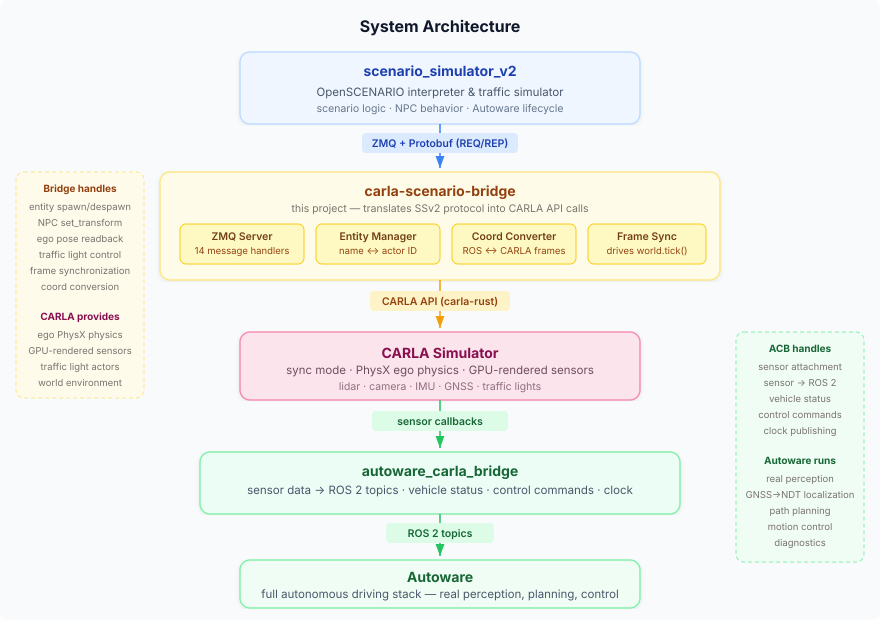

# carla-scenario-bridge

Run [OpenSCENARIO](https://www.asam.net/standards/detail/openscenario-v200/) scenarios in CARLA with Autoware processing **real sensor data** through its full perception pipeline.

## What is this?

[Autoware](https://autowarefoundation.github.io/autoware-documentation/main/) is an open-source autonomous driving stack. It is typically tested with [scenario_simulator_v2](https://github.com/tier4/scenario_simulator_v2) (SSv2), a framework that runs OpenSCENARIO files against a simulator backend. The default backend is a lightweight "simple sensor simulator" that feeds Autoware **ground-truth data** — perfect detections, exact positions — skipping the perception pipeline entirely.

[CARLA](https://carla.org/) is a photorealistic driving simulator with GPU-rendered cameras, ray-cast lidar, and PhysX vehicle dynamics. It produces realistic, noisy sensor streams that exercise Autoware's full stack: perception, localization (GNSS → NDT scan matching), planning, and control.

**carla-scenario-bridge** connects the two. It implements SSv2's ZMQ+Protobuf `simulation_interface` protocol, translating each request into CARLA API calls via [carla-rust](https://github.com/jerry73204/carla-rust). This makes CARLA a drop-in replacement for SSv2's built-in simulator or [AWSIM](https://github.com/tier4/AWSIM), letting you run the same `.xosc` scenario files against a high-fidelity environment where Autoware must actually *see* and *react* to the world.

### How it works

<p align="center">
  
</p>

Two sides, which meet only in CARLA and the map directory -- no shared ROS domain, host or
start order:

- **Simulation side** -- **SSv2** runs the OpenSCENARIO file, NPC behavior and the verdict;
  **carla-scenario-bridge** (this project) is CARLA's adapter for SSv2's protocol (spawns,
  moves, signals, time); the **agent relay** passes the scenario's goals for the ego to
  whatever drives it.
- **Vehicle side** -- your **Autoware** with this project's sensor kit and vehicle interface:
  **[autoware_carla_bridge](https://github.com/NEWSLabNTU/autoware_carla_bridge)** publishes
  CARLA's sensors, `/clock` and signals and applies Autoware's control; its **vehicle agent**
  takes goals from the relay and drives Autoware's API locally.
- **CARLA** owns physics, sensors and simulation time.

## Getting Started

### Prerequisites

- **CARLA 0.9.16** — [installation guide](https://carla.readthedocs.io/en/0.9.16/start_quickstart/)
- **ROS 2 Humble** — [installation guide](https://docs.ros.org/en/humble/Installation.html)
- **Autoware** — pre-built packages or source install ([docs](https://autowarefoundation.github.io/autoware-documentation/main/installation/))

Install and build with ROS tools ([User Guide, section 1](docs/user-guide.md#1-install)
has the details); Rust (rustup) and `pip install colcon-cargo-ros2` first:

```bash
git clone --recurse-submodules https://github.com/NEWSLabNTU/carla-scenario-bridge.git
cd carla-scenario-bridge
source /opt/ros/humble/setup.bash && source <Autoware>/setup.bash
rosdep install --from-paths src --ignore-src -y
colcon build --cmake-args -DCMAKE_BUILD_TYPE=Release --cargo-args --release
```

### Run

See the **[User Guide](docs/user-guide.md)**: prepare a map directory and a scenario
directory, then

```bash
./CarlaUE4.sh -RenderOffScreen -nosound                                    # CARLA
ROS_DOMAIN_ID=9 play_launch launch --enforce-rules off --web-addr 127.0.0.1:8084 \
    csb_launch simulation.launch.xml                                       # bridge + relay
ROS_DOMAIN_ID=1 play_launch launch --enforce-rules off --parser python \
    --composable-respawn on-crash --web-addr 127.0.0.1:8082 \
    acb_launch carla_simulator.launch.xml \
    map_path:=$CARLA_MAPS/Town01 relay:=tcp://localhost:5560              # your Autoware
ROS_DOMAIN_ID=9 play_launch launch --enforce-rules off --parser python \
    --web-addr 127.0.0.1:8081 csb_launch scenario.launch.xml scenario:=<file>.xosc
ROS_DOMAIN_ID=9 ros2 run csb_launch run_suite \
    $(ros2 pkg prefix csb_examples)/share/csb_examples/scenarios/basic --output <dir>  # a set
```

Starter scenarios (package `csb_examples`) need only `CARLA_MAPS`, the directory holding the
converted towns.

`play_launch launch` (`pip install play_launch`) runs `ros2 launch` files with per-node logs
and a web UI; the user guide explains each flag. Developers have the same launches as
`just run`, `just ego-av` and `just scenario <file>`.

## Project Structure

```
.
├── src/
│   ├── carla_scenario_bridge/      # Rust crate — ZMQ server + CARLA adapter
│   │   ├── src/
│   │   │   ├── main.rs             # Entry point, CARLA retry loop
│   │   │   ├── zmq_server.rs       # ZMQ REP socket, protobuf dispatch
│   │   │   ├── coordinator.rs      # 14 SSv2 handlers → CARLA API calls
│   │   │   ├── entity_manager.rs   # SSv2 name ↔ CARLA actor ID mapping
│   │   │   ├── coordinate_conversion.rs
│   │   │   └── traffic_light_mapper.rs
│   │   └── build.rs                # prost-build proto compilation
│   ├── csb_launch/                 # simulation, scenario, ego and demo launch files; run_suite
│   ├── csb_examples/               # starter scenarios: basic/, multi_av/, awf/ (installed)
│   ├── scenario_agent_relay/       # the scenario's side of the vehicle agent protocol
│   ├── autoware_carla_bridge/      # Submodule — sensor/vehicle interface
│   └── scenario_simulator_v2/      # Submodule — scenario framework
├── proto/                          # SSv2 protobuf definitions (8 .proto files)
├── scenarios/                      # benchmark scenarios (bench/) and goal-pose files
├── docs/
│   ├── design/                     # Architecture, protocol, launch config
│   ├── roadmap/                    # phased roadmap
│   └── user-guide.md
├── justfile                        # Build and run commands
└── Cargo.toml                      # Workspace root
```

## Documentation

- [Architecture](docs/design/architecture.md) — design principles, protocol details, responsibility split
- [SSv2 Protocol Reference](docs/design/ssv2-protocol.md) — the 14 ZMQ message types
- [User Guide](docs/user-guide.md) — install, map and scenario directories, running
- [User workflow and the vehicle agent](docs/design/user-workflow.md) — the two sides, the interfaces, swapping CARLA or Autoware
- [Writing scenarios](docs/design/scenario-authoring.md) — maps, the ego, other vehicles, signals, collisions
- [Roadmap](docs/roadmap/README.md) — phased implementation plan

## Development

### Available commands

```bash
just              # List all recipes
just setup        # One-time: rustup, colcon-cargo-ros2, submodules, rosdep install, dev tools
just build        # The user's colcon build + --symlink-install, dev-release profile
just clean        # Remove build artifacts
just check        # Format check (nightly) + clippy
just test         # Run tests with cargo-nextest, and run_suite's unit tests
just ci           # Build + check + test
just format       # Auto-format with cargo +nightly fmt
```

## Related Projects

- [autoware_carla_bridge](https://github.com/NEWSLabNTU/ros_zenoh_bridge) — sensor/vehicle interface between CARLA and Autoware
- [scenario_simulator_v2](https://github.com/tier4/scenario_simulator_v2) — Autoware scenario testing framework
- [AWSIM](https://github.com/tier4/AWSIM) — Unity-based simulator with SSv2 support (alternative backend)
- [carla-rust](https://github.com/jerry73204/carla-rust) — Rust bindings for the CARLA C++ API
